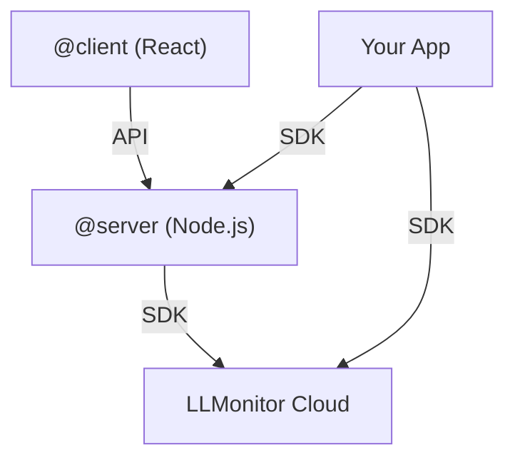

# LLMonitor

LLMonitor is an observability and analytics platform for LLM applications. This documentation covers the architecture, main packages, and how to integrate them into your projects.

## Architecture

The app is composed of three main packages:

- **@client**: User-facing frontend, built with React/Vite.
- **@server**: Backend, exposes APIs and business logic.
- **@sdk**: Universal SDK to instrument your apps and send events to LLMonitor.



## Packages

### @client

The platform's frontend. Allows users to view metrics, configure alerts, and manage their account.

### @server

Backend that exposes REST endpoints and webhooks. Processes events and forwards them to LLMonitor Cloud using the SDK.

### @sdk

Universal SDK for Node.js and browsers. Lets you instrument any app to send usage, metrics, and cost events to LLMonitor.

## Quickstart Guide

### 1. Install the SDK

```bash
npm install @llmonitor/sdk
```

### 2. Use the SDK in your app

```ts
import { LLMonitor } from "@llmonitor/sdk";

const monitor = new LLMonitor({
  apiKey: "YOUR_API_KEY",
});

monitor.logEvent({
  type: "inference",
  model: "gpt-4",
  prompt: "Hello world",
  response: "Hi! How can I help you?",
});
```

### 3. View your data

Access the dashboard in the frontend (`@client`) to see real-time metrics and events.

---

Continue exploring the documentation for advanced details, examples, and API references.
